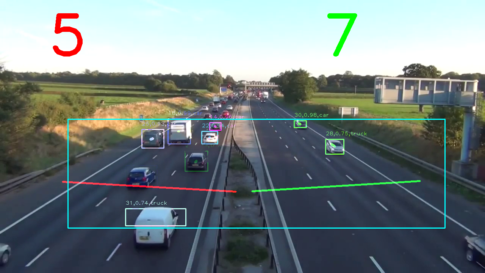

1. First of all download weights of YOLOv3 416X416: https://pjreddie.com/darknet/yolo/
2. Put .weights file to config folder
3. Run Start.bat 
4. Two windows will pop-up, there you must draw a line perpendicular to the direction of movements. When detected car crosses that line, the car will be counted
5. In the third pop-up window you must specify an area(Region of Interest). Only cars in that area will be detected.
6. Then, the video processing will start. Processed video and extracted frames will be in the "output" folder.

If you want to process another video, put this video in the "input" folder and name it "Input.mp4". Then run Start.bat

By running the main.py from command prompt you can specify some arguments(Do not type " " symbols):

python main.py --input "path to the input file" --output "path to the output folder" --yolo config --confidence "minimum confidence threshold for detection" --threshold "threshold for Non-maxima suppression"

Example of program results:

